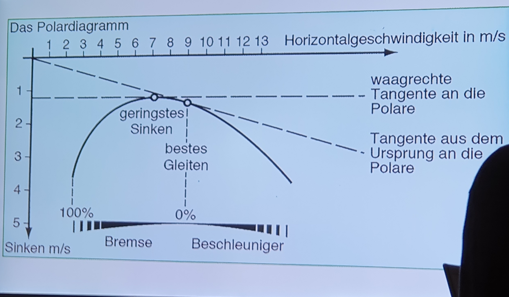

## Luftkräfte
- Auftrieb entsteht durch Impulsändeurng der Luft nach unten und außerdem durch Sogeffekt durch unterschiedliche Drücke auf Ober- und Unterseite aufgrund der Beschleunigung der Luftteilchen durch das Profil
- FA = CA \* Luftdichte/2 \* A \* v²
- FW = CW \* Luftdichte/2  \* A \* v²
- **Widerstandskomponenten**
	- **Flügelwiderstand**
		- Formwiderstand (aerodynamischer Widerstand)
		- induzierter Widerstand
		- Grenzschichtwiderstand
	- **Schädlicher Widerstand**
		- Restwiderstände (Leinen, Pilot)
		- Interferenzwiderstände (besonders bei aufeinander folgenden Leinen)
- Reduzierung der Leineanzahl und trotzdem Beibehaltung der Profilgenauigkeit ist durch diagonale Rippen möglich -> große Reduzierung des Gesamtwiderstands
- beim Gleitschirm ändert sich der Auftriebsbeiwert und tlw. auch die Fläche durch das Ziehen der Bremsleine
- Bodeneffekt spielt beim Gleitschirm keine Rolle, beim Drachen schon
- Wirbelschleppen eines Gleitschirms können bis zu 30 s bestehen
- niemals in Wirbelschleppe von Flugzeugen fliegen
- [Flächenbelastung](Allgemeines#^b8de22) beeinflusst Gleichgewichtslage Fluggeschwindigkeit - Anstellwinkel -> je geringer die Flächenbeslastung desto langsamer der Flug
- [gesamte Luftkraft](Allgemeines#^2a81a9) = Gewichtskraft (da Schub = 0)
- Druckpunkt ist Kräftemittelpunkt
- Gleitschirm hat eine Pendelstabilität (Rollen und Nicken), Gierstabilität wird duch Pfeilung und durch Rundung im Flügel (vergleichbar mit Seitenleitwerk)

## Profilpolare

- Polare äquivalent für C_A / C_W
- Geschwindigkeit des besten Gleitens ist abhängig von der Windgeschwindigkeit (Ursprung der Gerade im Diagram verschiebt sich in X-Richtung) und dem Abwind (Ursprung verschiebt sich in Y-Richtung)
- der Beschleuniger verschlechtert die Polare (verstärkt das Sinken) aber verlängert die Polare nach hinten (höhere Horizontalgeschwindigkeiten) -> bei Gegenwind verschiebt sich der Punkt des bestens Gleitens und kann so wieder besser getroffen werden
	- bei 10 km/h Wind Beschleuniger etwa 1/3 treten, bei 20 km/h 2/3
	- bei 3 m/s Abwind etwa 1/3 treten, bei 6 m/s etwa 2/3. Es ist meist sinnvoll, so schnell wie möglich aus dem Abwindgebiet rauszufliegen
	- mit Beschleuniger wird der Schirm klappanfälliger, deshalb in Bodennähe nicht beschleunigen