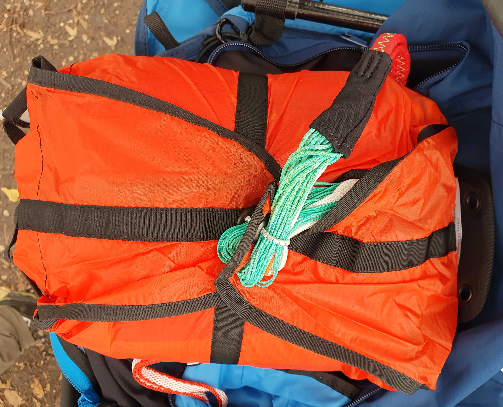

## Musterprüfung
- von 2 Piloten am unteren und oberen Gewichtslimit
- jede Kategorie wird einzeln bewertet -> A-Schirm muss in allen Kategorien A-Wertung haben
- wird alles in einem einzigen Testflug festgestellt
- Testbericht wird veröffentlicht
- geflogene Tests:
	1. Füllen/Start
	2. Landung
	3. Geschwindigkeiten
	4. Steuerkräfte
	5. Nickstabilität
	6. Rollstabilität
	7. Verhalten in Steilspirale
	8. selbstständiges Ausleiten des Sackflugs
	9. Ausleiten des Fullstalls
	10. Klapper (normal und beschleunigt)
	11. Trudeln
	12. B-Stall
	13. Ohren anlegen

## Stückprüfung
- alle Schirme müssen gleich wie das Muster gebaut werden
- nach der Fertigung gibt es Stichproben
- vor der Auslegung an den Kunden muss der Hersteller oder die Flugschule jeden Schirm testen

## Nachprüfung
- nach 24 Monaten oder 150 Flugstunden
- am besten beim Hersteller machen lassen
- Lebensdauer etwa 10 Jahre

## Rettungsgerät
- 50 m bis vollständig entfaltet
- 6.8 m/s Sinkrate nach DIN
- 5.5 m/s Sinkrate nach EN
- Leinen dea Fallschirms sollten länger sein als vom Gleitschirm
- man bleibt 20% unter der max. zugelassenen Anhängelast -> verringert die Sinkrate
- 1x pro Jahr auslüften und neu packen
- 10 Jahre Lebensdauer
- Rundkappe, Kreuzkappe (leichte Vorwärtsfahrt) Dreieck, Rogallo (steuerbar)
- Rundkappe und Kreuzkappe neigen zum Pendeln, deshalb Loch in der Mitte
- Luftautrittsklappen sorgen dafür, dass Schirm stabiler ist
- Kompatibilitätsprüfung Rettungsschirm-Gurtzeug muss ein Fluglehrer oder ein Flugschule machen
- Schirmvolumen darf nicht größer sein als Außencontainer im Sitz, aber auch nicht zu klein, weil sich sonst die Leinen verfangen können
- Splinte müssen immer verschlossen sein, sonst kann sich der Schirm im Flug selbst auslösen
- Zug immer seitlich weg vom Körper, nicht nach oben
- Schirm bei Wasserlandung immer gefährlich
- Cuttermesser um Leinen im Notfall zu trennen, wenn sich der Schirm verfängt (im Wasser)
- Immer Schwimmweste in Wassernähe, gibt selbstaufblasende mit Patrone
- immer mal wieder nach dem Start einen Wurf simulieren

### Retter packen
- 1x pro Jahr
- nach dem Öffnen Leinen zu Luftschlaufen knüpfen, damit die Leinen nicht verwickeln. 1 Tag auslüften lassen.
- Bahnen mit Schnur den Zahlen nach an den Ösen aufnehmen und zuziehen (21 Stück)
- Spannung zwischen Anseilschlaufe und Schnur in Ösen aufbauen (am besten zwischen 2 festen Punkten aufhängen)
- **Bahnen sortieren**: Bahnen symmetrisch links & rechts von Stammleinen aufteilen, beginnend/endend bei 0 oder an Bahn mit Schlitz (3&4). Dabei von oben reinschauen und alles bis zur Naht rausziehen. An den Ecken (erkennbar an Schlitz in Bahn, z.B. beim Dreieck zwischen 3&4) kontrollieren, dass die Bahnen der Stammleinen richtig liegen, sodass man durchschauen kann. Am Ende wieder zum 3&4 Schlitz oben umschlagen und Mittelbahnen in roter Bahn unten grmeinsam (hier weiß).
![[Anlage/Retter_sortieren.jpg]]
- **Leinen sortieren**: kein Leinenüberwurf um Stammleinen, Leinenpacket links und rechts gebündelt. Gegebenfalls Anseilschlaufe zum entwirren entdrehen. Leinenpaket in sich darf Dreher haben. Es dürfen äußere Leinen ganz außen oben drüber liegen, da diese eh alle nach außen aufgehen (Dreieck), solange keine Verwicklung mit Stammleinen.
- **Ablegen**: gesammelt als Paket alles ablegen, Leinen sind alle gebündelt auf einer Seite. Dann wieder bis Hälfte (3&4-Bahn) aufklappen. Leinen mit Gewicht beschweren.
- **Falten**: beide Seiten getrennt falten. Erst ganzes Paket auf andere Seite umschlagen, dann Bahn für Bahn zurückfalten und glatt streichen. Dabei auf Pfeile auf dem Tuch für Faltweise achten (unten die Außenkante nach innen reinfalzen, oben 2x umschlagen und Mitte auf Anschlag rausziehen). An den Schlitzen die Mittelbahnen sortieren und nach innen & oben reinschieben, muss nicht zu ordentlich sein, dann öffnet die Kappe besser. Wichtig: Eintrittskante unten muss sauber liegen und durch Luft aufgehen können
- **S-Schläge**: beide Seiten um lange Kante falten mit S-Schlag auf Containerbreite, dann um kurze Seite falten mit S-Schlag auf auf Länge des Containers (wie Ziehharmonika, nie 2 mal in die gleiche Richtung falten).
- Paket in Container legen, Leinenenden gegenüber vom Griff und oben.
- **Schnur wieder rausziehen!**
- **Leinen vorbereiten**: Leinen von der Schlaufe aus zusammenraffen, damit es am Ende keine überstehenden Leinen gibt. 3 Blätter schließen, eine Schlaufe durch die Contaimeröse
- **Leinen schlaufen**: 6 Stäbe/Finger richten und Gummis darüberstreifen (neue Gummis oder einfach weglassen). Leinen 3-4x um 2 Finger/Stäbe Schlaufen, dann weiter zu den nächsten 2. Gummis über Leinen stülpen und die Leinenpakete in den Container ablegen.
- **Container verschließen**: 3 Containerblätter schließen, mit Leinenrest Schleife (max. 2 cm) durch Containergummi legen. 4. Containerblatt schließen, dann mit Leinenrest Schleife (max. 2 cm) durch Containergummi legen
- **Einbauen**: Container mit Schulterbefestigung verbinden und einbauen (glatte Seite zum Sitzbrett, Griff und Anseilschlaufe nach außen). Beide Reißverschlüsse oben und unten wieder zumachen.

## Helm
- nach Norm EN 966 (eventuell auch EN 1077 **Klasse A**)
- [Meinung DHV Vorteil EN 966](https://www.dhv.de/fileadmin/user_upload/files/2021/Sicherheit_2021/Vergleich_Helmnormen_fuer_Flugsport_und_Skisport.pdf)
- [Meinung Gleitschirmschop Vorteil EN 1077](https://gleitschirm-optimal.de/gleitschirmhelm-oder-skihelm/)
