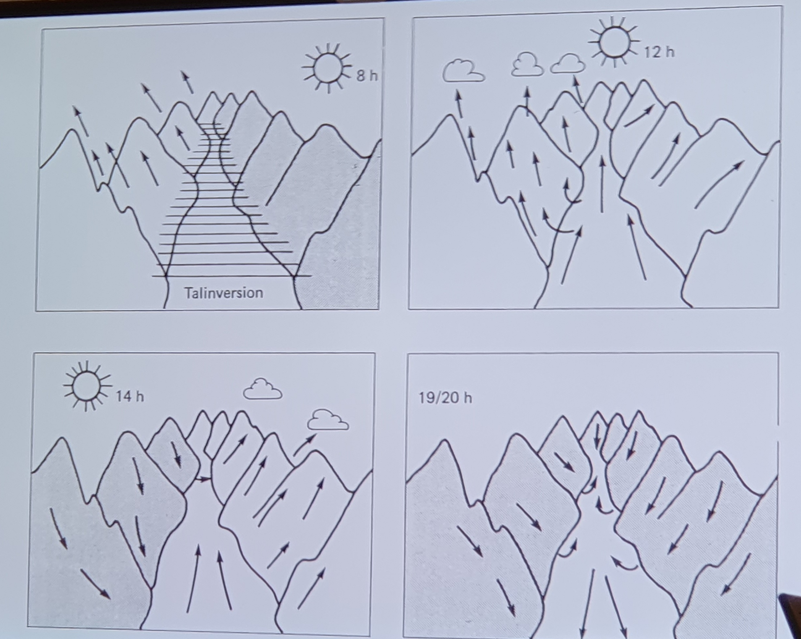
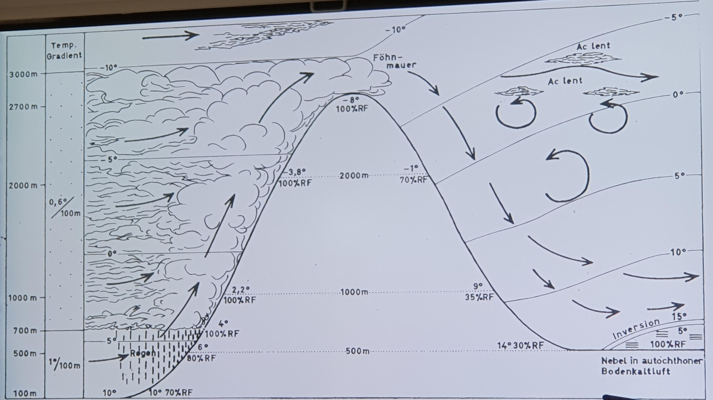
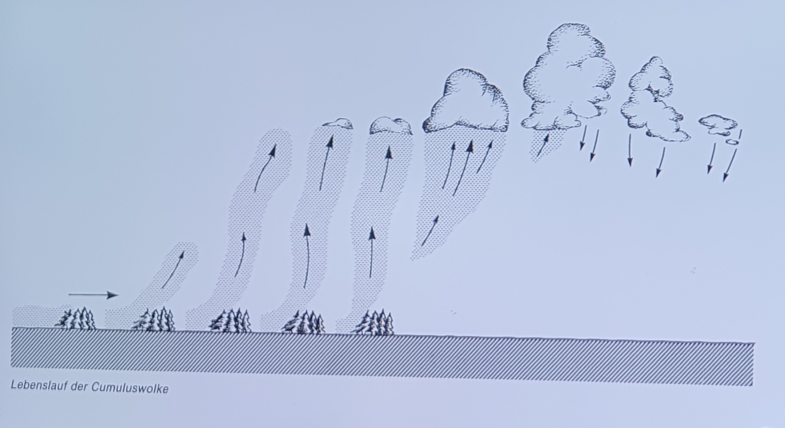
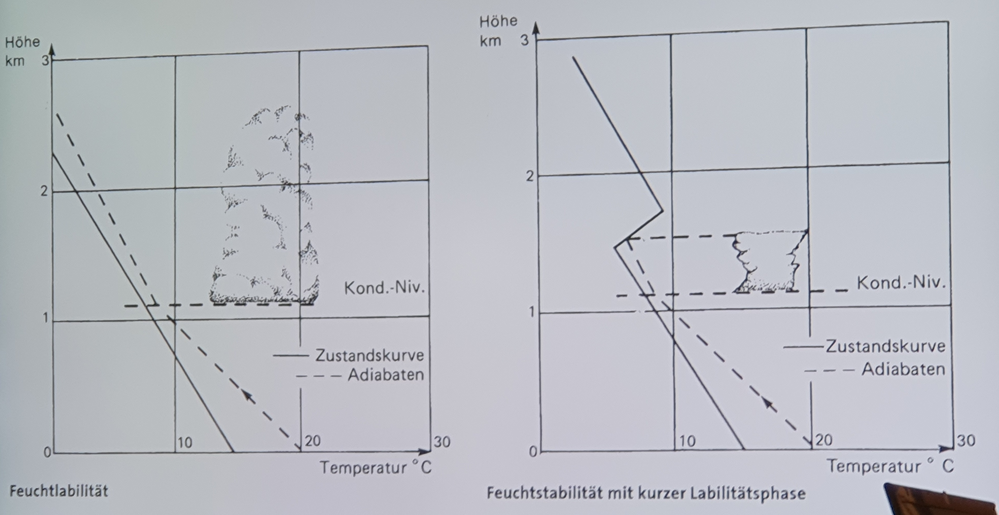
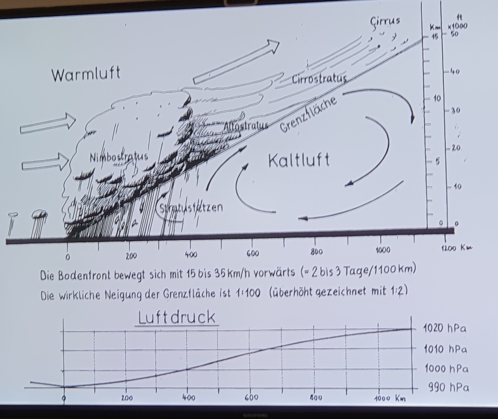
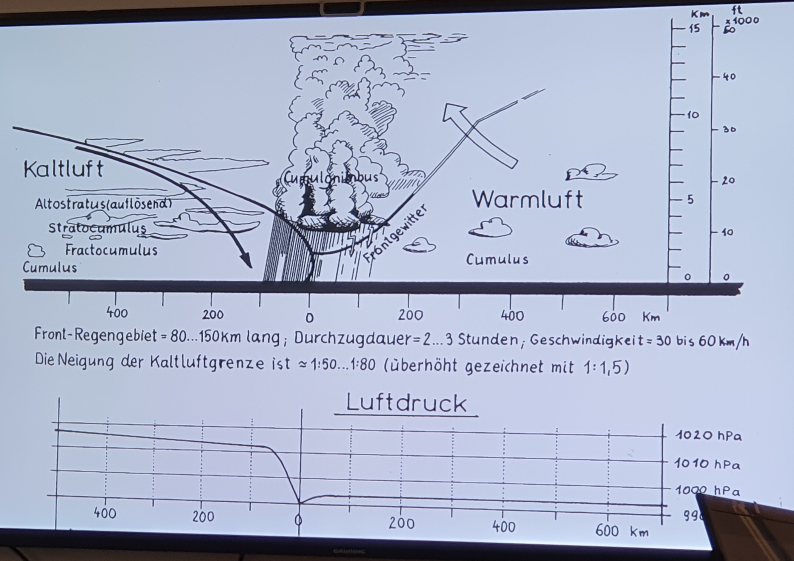
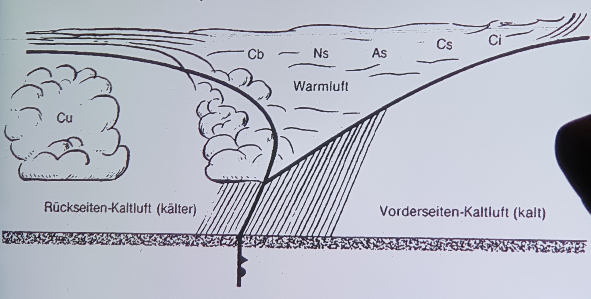
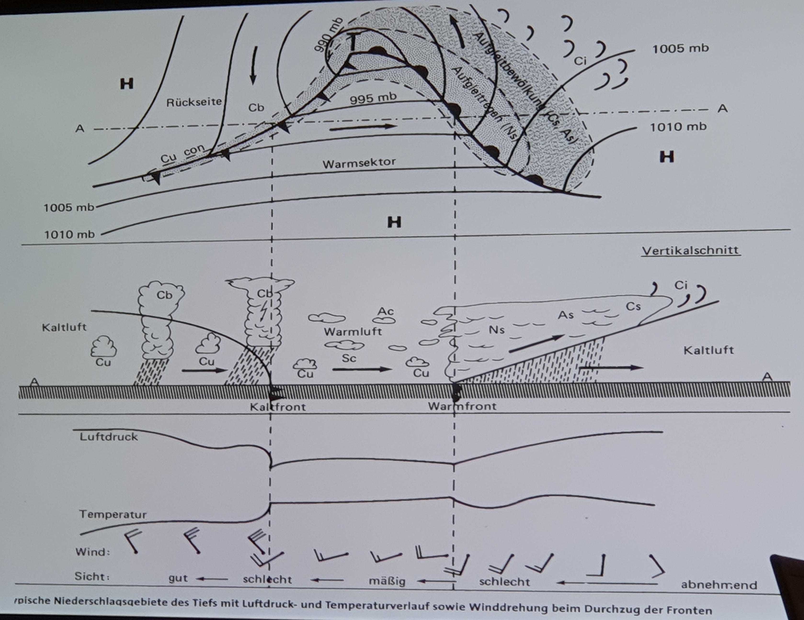
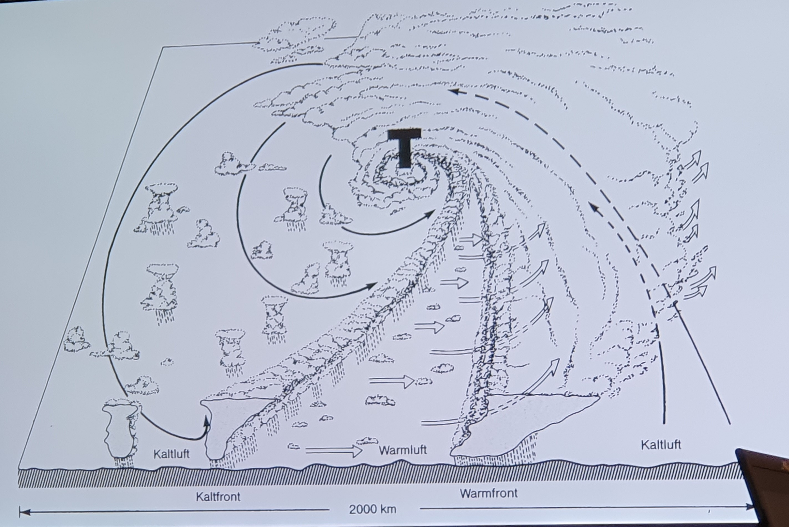
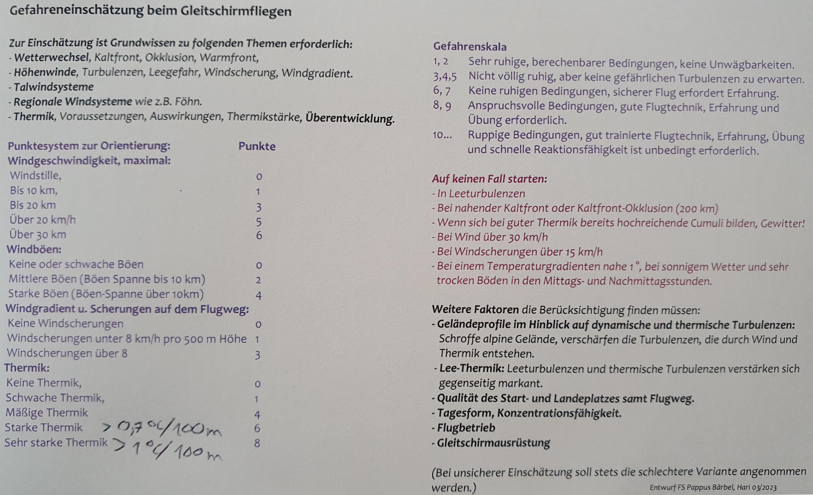

## Grundlagen
- Windrichtungen in Gradzahlen
- Winde sind immer aus der Richtung benannt, aus der sie kommen
- Hänge werden nach der Richtung benannt, auf die sie zeigen -> für einen Nordhang braucht man Nordwind

- Mechanismen der Wärmeübertragung
	- Strahlung
	- Konvektion
	- Phasenübergang
	- (Wärmeleitung)

### Strömungen und Turbulenzen
wichtige Phänomene sind:
	- turbulente Strömungen ausgelöst durch Hindernisse
	- Leewalzen bei scharfen Geländekanten (vertikal und horizontal), Auswirkung bis 10-fache Hindernisshöhe
	- Aufwindgebiete (Soaring)
	- Kanalisierungseffekte im Tal
	- Windscherung: Richtungsscherung/Geschwindigkeitsscherung von Winden aus unterschiedlichen Richtungen oder Schichten
	- Nachlauf (Windräder, Flugzeuge). Bei Windrädern das 5-7-fache des Rotordurchmessers im Nachlauf Abstand lassen.

### Atmopsphäre
- Wetter spielt sich in der Troposphäre ab (bis 12 km)
- Stratospähre ist wärmer als Troposphäre und "deckelt" sie ab
- im Durchschnitt pro 5.5 km Höhe halbiert sich der Druck in der Troposphäre oder 1 hPa / 8 m auf Meereshöhe, auf 5500 m 1 hPa / 16 m. 
- im Durchschnitt bei normaler Schichtung &Delta;T = -0.65 °C / 100 m in der Troposphäre
- Sonderfälle sind
	- Inversion: Temperatur nimmt mit der Höhe zu
	- Isothermie: Temperatur über die Höhe konstant

### aufsteigende Luftmassen
- p/&rho;RT = konst
- Die Luft erwärmt sich wenig durch die Sonne, sondern der Erdboden -> warme Luft steigt auf und kühlt sich durch kompressible Entspannung aus -> Thermik entsteht durch Temperatur(/Dichte)unterschiede
- mit steigender Temperatur kann Luft exponentiell mehr Wasser aufnehmen -> RH nimmt bei aufsteigender Luft zu
- Termperaturverlaufskurve (Temp, aus Messsonden) gibt Auskunft über den tagesaktuellen Verlauf der Temperatur über der Höhe
- der Schnittpunkt der Temperaturkurve mit der Taukurve gibt die Wolkenbasis an (siehe [Thermik](#Thermik)
- -1 °C / 100 m Höhe Temperaturabnahme für **aufsteigende** Luftmassen (trockenadiabat). Bei Wolken d.h. RH=1 kompensiert tlw. die Kondesationswärme, deshalb ca. -0.5 °C / 100m (feuchtadiabat)

### Stabile/labile Wetterlage
- für konstante Schönwetterlage in Hochdruckgebieten braucht man **Höheninversion** (**Absinkinversion**): Dabei ist in Bodennähe die Temperatur kälter als in 2000 m.
- Entstehung der Inversion: Ein Luftpaket sinkt (z.B. im Hochdruckgebiet) und erwärmt sich dabei. Dabei sinkt die Obergrenze aufgrund der Kompressibilität weiter als die Untergrenze. Somit erwärmt sie sich dort mehr was zur einer (zeitlich begrenzten?) stabilen Temperaturinversion führt.
- Die absinkende, sich damit erwärmende Luft "deckelt" die aufsteigende, warme Luft die vom sich erwärmenden Boden aufsteigen will -> **stabile Wetterlage**, Wolkenwachstum ist nach oben begrenzt
- wenn Luftpakete bei normaler Schichtung unbegrenzt aufsteigen (z.B. im Tiefdruckgebiet), steigen sie so lange bis ein Druckgleichgewicht herrscht -> **labile Wetterlage**, hohe Wolkenbildung und Schönwetterschauer möglich

## Überregionaler Wind / Höhenwind
- Kenntniss des überregionalen Winds ist essentiell zur Beurteilung der Windsituation am Startplatz
- Auskunft über unbeeinflussten Höhenwind gibt:
	- Windkarte
	- Wolken
	- Vögel
- Einfluss auf Luftdruck hat
	- Lufttemperatur
	- Luftfeuchte
	- etc.
- diese Druckunterschiede verursachen Ausgleichsbewegungen -> horizontale/vertikale Strömungen aka. Winde. Diese bewegen sich in Bodennähe (bis 2000 m), in höheren Schichten gibt es Rückströmungen
- in Tiefdruckgebieten stoßen Luftmassen aufeinander und steigen auf -> Abkühlung -> Luft kann weniger Wasserdampf halten -> Niederschlag
- in Hochdruckgebieten sinkt die Luft als Ausgleichsbewegung ab
- jede Luftströmung auf der Nordhalbkugel wird in Flugrichtung nach rechts abgelenkt (Korioliskraft und Zentrifugalkraft) -> insgesamt dreht somit das Hochdruckgebiet rechtsrum und das Tiefdruckgebiet linksrum
- je weiter die Isobaren auf der Isobarenkarte auseinander sind, umso geringer sind wahrscheinlich die Winde. Je ausgepägter Hochdruckgebiete sind, umso beständiger sind sie.

## Kleinräumige Windsysteme (Tagesperiodische Winde)

- "bodennahe Windmassen strömen von kalt nach warm"

### Land- und Seewind
- Wind strömt tagsüber vom Meer zum Land
### Berg- und Talwinde
- **anabatischer Wind (thermischer Hangaufwind)** morgens:
	- Einstrahlwinkel begünstigt Erwärmung des Hangs
	- trockene Gebiete (Hänge) erwärmen sich schneller
- **katabatischer Wind (thermischer Hangabwind)** abends:
	- abends kühlen sich die Hänge wieder ab (solange nicht durch Wolken "gedeckelt")
	- ausgelöst durch die Dichte der kalten Kuft
	- Konvergenz im Tal führt in der Talmitte wieder zu Aufwinden, besonders, wenn der Ausfluss aus dem Tal durch andere Winde etc. "versperrt" ist
	- führt über nacht zu Kaltluftseen (Talinversion): Luft über den Berghängen kühlt ab -> höhere Dichte -> Luft sinkt und füllt das Tal 2/3 hoch mit kalter Luft -> diese fließt dann das Tal hinaus -> Kaltluftsee schützt vor überregionalem Wind
	- **Bodeninversion:** Boden kühlt über Nacht aus -> kann durch Wolkenschicht behindert werden -> Labilität am morgen, anfällig für überregionale Winde
- die Summe der anabatischen Winde löst dann insgesamt das **Talwindsystem** aus, dass sich durch das ganze Gebirge erstreckt. -> **Talwindkarte**. Dieses System kann sich bis 2/3 der Hanghöhe erstrecken
- zweiter Effekt begünstigt dieses System: Luft erwämt sich durch Sonneneinstrahlung direkt an den Hängen. Da die Hänge am Berg höher liegen ist die Luft dort wärmer als in gleicher Höhe im Vorland
- insgesamt ein sehr träges Phänomen
- am stärksten bei hoher Strahlungsintensität

## Regionale Windsysteme

### Föhn

- für uns problematisch ist der Südföhn:
- Südwind am Alpenhauptkamm, ausgelöst durch Tiefdruckgebiet auf der Alpennordseite
- Luft staut sich am Kamm auf
- entsteht ab 4 (manchmal 3) hPa Druckdifferenz von Süd- zu Nordseite der Alpen, bei negativer Druckdifferenz entsteht Nordföhn
- wenn der Wind stark genug ist, wird die Luft über die Alpen gehoben
- es gibt Steigungsregen ab ca. 700 m
- ab dem Kondesationsniveau sinkt die Temperatur nur noch mit 0.6° / 100m
- die Luft verliert dabei sehr viel Wasser
- wenn der Kamm überschritten wird, sinkt die nun sehr trockene Luft und erwärmt sich dabei mit 1°/100m
- auf der Alpennorseite entsteht ein Schönwetterband mit klarem Wetter und wenig Luftfeuchte, obwohl eigentlich ein Tiefdruckgebiet vorliegt
- auf der Leeseite hohe Windgeschwindigkeiten und viel Turbulenz
- erkennbar von Norden an abreißenden Wolken am Kamm
- diese Leewalze setzt sich wellenartig nach Norden fort: an darauffolgenden Gipfeln gibt es wieder Wolkenbildung (Lentikularis, linsenförmig, gehöhrt zu den Alto-Cumuluswolken) -> sehr markant
- Wind ist vorher auf der Norseite nicht zu bemerken, wenn gerade ein Kaltluftsee vorliegt und der Wind darüberbläst

### weitere regionale Windsysteme
- in Freiburg gibt es Föhnartige Winde bei Westwind durch die Vogesen -> besseres Wetter in Freiburg
- "Bisel" in der Schweiz: ausgelöst durch Nordwind, der von Alpen nach Westen abgelenkt wird und durch das schweizer Jura kanalisiert wird
- Mistral in Frankreich: Nordwind, kanalisiert durch Alpen und dem französischem Zentralmassiv (Rhonetal, Marseile)

## Thermik

- der Dichteunterschied lässt warme Luftblasen aufsteigen
- ab ca. 3° Temperaturunterschied
- Quellen sind trockene, warme Flächen, die möglichst rechtwinklig von der Sonne angestrahlt wird:
	- Berghänge
	- dunkle Flächen
	- geringe Wärmeleitfähigkeit, sonst wird Wärme nach innen abgeführt
	- am besten sind Torf oder Asphalt
- Thermikbart kann durch einen "Auslöser" abgerissen werden, ein Impuls (Wind der warme Luft gegen ein Hindernis wie ein Waldstück bläst, ein Zug der durchfährt, ein Bauer auf dem Feld, Bergkanten oder Gipfel)
- Wind kann Thermikbart über dem Gipfel verblasen, es wird turbulent (Leethermik)
- durch den sinkenden Druck, verbreitern sich die Barte nach oben hin
- durch Abkühlung entstehen irgendwann **Cumuluswolken**, ab hier sinkt die Temperatur nur noch mit 0.5 °/ 100 m -> Knick inm Temperaturverlauf
- die Höhe der Wolkenbasis hängt von der relativen Feuchte der aufsteigenden Luft ab
- gut sichtbar durch wachsende Wolkenfetzen, kann aber auch schon vorher angefolgen werden
- wenn die Außenform scharf und die Basis konkav ist, dann gibt es noch aufströmende Luft und aktive Thermik, die Wolke wächst
- wenn sich die Basis nach unten ausbeult und die Außenform komplexer wird, dann ist die Quelle erloschen und die Wolke schrumpft, das Wasser verdunstet und es gibt sogar nach unten strömende Luft
- Lebensdauer zwischen Minuten und Stunden
- bei Überentwicklung gibt es Schönwettergewitter

- je nach Temperaturschichtung der ungestörten Atmosphäre und damit dem Temperaturunterschied zum Thermikbart ist die Bartgrenze stark turbulent
- Temperaturdifferenz am Erdboden am Größten
- wenn die Umgebungsluft labil ist, steigt die Temperaturdifferenz dazu mit der Höhe an, Thermik und Turbulenz nimmt nach oben hin zu
- über dem Kondensationsniveau, der Wolkenbasis, stiegt bei labiler Wetterlage die Temperaturdifferenz und die Aufwinde wieder an -> Gefahr für Gleitschirmflieger!
- außerdem dehnt sich die Wolke immer weiter nach oben aus, die Luft kühlt imme weiter ab und es kommt zu Schauern und Gewittern (Cummulus-Castellani, türmchenwolken)
- bei Inversionslage (in einem Hochdruckgebiet) ist dieser Temperaturanstieg (die Labilitätsphase) gedeckelt -> sichtbar an nach oben begrenzten **Ambosswolken**
- Taupunktkurve:
	- Temperatur, bei der Wasser kondesiert, dargestellt als Verlauf über der Höhe
	- wenn sich dieses Kurve und die tatsächliche Temperaturkurve schneidet, kommt es zur Wolkenbildung
	- die Differenz Temperatur- Taupunkt nennt sich **Taupunktdifferenz** oder **Spread** angegeben in Grad
	- mit dieser Differenz kann abgeschätzt werden, ob es am Landeplatz voraussichtlich zu Nebelbildung kommt (z.B. im Herbst)

### Fliegen in der Thermik
- Einstieg ist besonders schwierig, da am Boden der Thermikbart noch sehr schmal ist, dafür aber stark
- bei hoher Temperaturdifferenz in der Temperaturkurve (> 0.7°C/100m) gibt es sehr starke Thermik -> **zu gefährlich, nicht fliegen**
- Thermikränder sind immer turbulent, der Kern häufig ruhig
- bei starkem Wind (ab 20-30°) sind die Termikbärte zerzaust, besonders die Leeseite gefährlich turbulent -> für Thermikflüge muss der überregionale Wind schwach sein
- aktives Fliegen wichtig!
- wenn der Schirm einseitig Austrieb erhält stark in diese Richtung einkreisen
- wenn man gleichmäßig auftrieb erhält langsam Einkreisen
- wenn die Thermik wieder schwächer wird, steile Kurve fliegen um wieder reinzukommen -> Kern der Thermik identifizieren und darum kreisen
- Blauthermik: Thermik ohne Wolkenbldung
	- bei sehr trockener Luft
	- oder bei fehlenden Kondesationskeimen (bei sehr sauberer Luft, z.B. nach Regen)

## Wolken
- Höhe wird durch Vorsilben angegeben:
	- ohne -> bis 2.5 km
	- Alto -> bis 6 km
	- Cirrus -> bis 12 km
	- Nimbus -> Regenwolke
- 2 Wolkentypen
	- Cummulus (Haufen)
		- normalerweise in 900 m, in den Alpen bis 4500 m Höhe
		- lokale Entstehung
	- Schicht
		- Anzeichen von Frontengrenzen
		- begrenzen Effekt der Thermik
- Faustformel: wenn Wolken höher als breit sind, besteht die Gefahr der Gewitterbildung
- wenn Wolken unten klar Kanten haben, weiter oben ambossförmig aber flauschig sind, gibt es oben Vereisungsprozesse -> Hagel -> Abkühlung auch weiter unten -> Gewitter
- Gewitter kündigt sich durch kalten Wind an, dies ist die ausfließende kalte Luft, oben drüber wird die warme Luft in die Wolken gesaugt

## Wetterwechsel
- Zyklone entstehen vor allem im 30° und 60° Breitengrad (Azorenhoch, Islandtief)
- dynamisches Hoch/Tiefdruckgebiet
- Aufeinandertreffen von kalten und warmen Strömungen
- erzeugt Kalt- und Warmfronten
- Kaltfront Linie blau mit ^,  Warmfront rot mit Halbkreis, Ausbreitung in Richtung der Symbole. Okklusion pink mit beiden Symbolen

### Warmfront

- kalte Luft hat höhere Dichte, warme Luft steigt daran auf (**Aufgleitinversion**)
- Schichtwolken entstehen und sind damit Anzeichen für eine Warmfront, diese ist aber noch 600-800 km entfernt
- weiteres Anzeichen ist der sinkende Luftdruck

### Kaltfront

- schlecht anhand der Wolkenbilder vorherzusehen
- heftige Gewitter möglich
- schlagartiges Ansteigen des Luftdrucks, aber erst bei Eintreffen des Gewitters
- **Nie vor der Kaltfront fliegen!**
- Kaltfront staut sich an den Alpen auf, kann sich aber über Täler ausbreiten und warme Thermik unterwandern -> Gefahr!
- bewegen sich schneller als Warmfront und holt sie oft ein (Okklusion)

### Okklusion

- wenn eine Kaltfront die Warmfront einholt, dann gibt es eine neue Kaltluft-Kaltluft Grenze am Boden, die Warmluft-Kaltluft Grenze wird vom Boden abgehoben
- hat ähnlichen Charakter wie Kaltfront

### zeitlicher Verlauf
typischer Schlechtwetterdurchgang in unseren Breiten:

- Tief zieht nördlich von uns vorbei (da Zyklone im 60° Breitengrad, aka. **Islandtief**)
- Fronten ziehen über uns rüber, erkennbar am Regen -> Regenradar
- abhängig von der Bewegungen der Tiefs/Hochs
- zum Fliegen sollte die Front mindestens 200 km entfernt sein
- Barisches Windgesetz: stehst du mit dem Rücken zum Wind, gibt es vorne links ein Tiefdruckgebiet und hinten rechts ein Hochdruckgebiet (Schnittpunkt zweier Zyklone)

## Wetterberichte
- Zuerst schauen beim [DHV](https://www.dhv.de/2/piloteninfos/wetter/)
- Frontenkarte: [Meteoschweiz](https://www.meteoschweiz.admin.ch/service-und-publikationen/applikationen/allgemeine-lage.html#tab=general-situation-map), [ZAMG](https://www.zamg.ac.at/cms/de/wetter/wetterkarte), [Wetterzentrale](https://www.wetterzentrale.de/de/fax.php?model=dwd)
- Isobarenkarte: [Wetteronline](https://www.wetteronline.de/profiwetter/europa)
- Temperaturzustandskurve (TEMP): [Meteo Parapente](https://meteo-parapente.com/#/), [Wetteronline](https://www.wetteronline.de/?gid=euro&pcid=pc_modell_expert&pid=p_modell_expert&sid=Radiosondes)
- lokale Vorhersage: [Windy.com](https://www.windy.com/), [Meteoblue](https://www.meteoblue.com/de/wetter/woche/fellering_frankreich_3018748), [Wetterzentrale.de](https://www.wetterzentrale.de/de/show_diagrams.php?geoid=140712&model=multi&var=4&run=12&lid=OP&bw=1), [Wetteronline](https://www.wetteronline.de/wetter)
- Regenradar: [Meteoblue](https://www.meteoblue.com/de/wetter/maps/deutschland_deutschland_2921044#map=radar~radarMap~none~none~none&coords=4/51.5/10.5), [Wetteronline](https://www.wetteronline.de/regenradar?mode=interactive)
- Windvorhersage: [Meteo Parapente](https://meteo-parapente.com/#/), [Meteoblue](https://meteoblue.com), [Wetteronline](https://www.wetteronline.de/wind), etc.
- Flugwetter: [DWD](https://www.dwd.de/DE/fachnutzer/luftfahrt/teaser/luftsportberichte/luftsportberichte_node.html), [Austrocontrol (Anmeldung)](https://www.austrocontrol.at/flugwetter/),  [Windy.com](https://www.windy.com/)
- Thermikvorhersage: [Meteo Parapente](https://meteo-parapente.com/#/), [DHV](https://www.dhv.de/2/piloteninfos/wetter/), [Meteoblue (paywall)](https://www.meteoblue.com/de/wetter/aviation/crosssection/deutschland_deutschland_2921044#)
- Föhn: [Wetter Südtirol](https://wetter.provinz.bz.it/foehndiagramm.asp), [Meteocentrale.ch](https://www.meteocentrale.ch/de/wetter/foehn-und-bise/foehn.html)
- lokale Wetterstationen: [holfuy.com](https://holfuy.com/de/map), [openwindmap.org](https://www.openwindmap.org/), [Balisesmeteo](http://www.balisemeteo.com/balise.php?idBalise=136)

Windfahnen in der Windvorhersage
- aus der Richtung aus der sie kommen
- kleine Feder 5 Knoten
- große Feder 10 Knoten
- Knoten -> km/h : \*2 - 10%

## Gefährdungsbeurteilung
